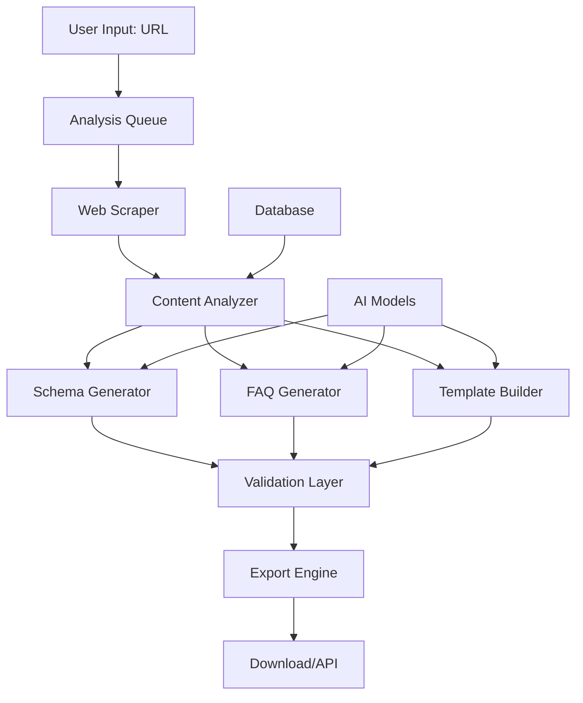

# Option C: AEO Optimizer SaaS Tool
## Building a Scalable AI-SEO Platform

---

## Executive Summary

**Product Name:** AEOptimizer (or SchemaGenius, AIReadySEO)

**Vision:** "The Yoast of AI SEO - One-click optimization for AI browsers and answer engines"

**Product Model:** Self-serve SaaS tool with tiered pricing

**Target Price:** $49-299/month

**Time to MVP:** 3-4 months

**Time to Revenue:** Month 4

**Target Year 2 ARR:** $2.4M

---

## Product Overview

### Core Value Proposition
"Generate complete AEO packages in 60 seconds - schemas, FAQs, templates, and implementation guides tailored to your industry and website."

### Key Features

**MVP Features (Month 1-3)**
- Website analysis & AEO scoring
- Schema generator (5 types)
- FAQ generator (up to 20 questions)
- robots.txt generator
- Basic templates (blog, page)
- Export to JSON/HTML

**Phase 2 Features (Month 4-6)**
- Competitor analysis
- Content optimizer
- AI browser testing
- Google Docs export
- WordPress plugin
- API access

**Phase 3 Features (Month 7-12)**
- Multi-site management
- Team collaboration
- White-label options
- Custom schema builder
- Content calendar
- Automated monitoring

---

## Technical Architecture

### Tech Stack

**Frontend**
```
Framework: Next.js 14 with App Router
UI Library: Tailwind CSS + shadcn/ui
State Management: Zustand
Forms: React Hook Form + Zod
Analytics: PostHog
Error Tracking: Sentry
```

**Backend**
```
Framework: Next.js API Routes / Serverless
Database: PostgreSQL (Supabase/Neon)
Queue: BullMQ with Redis
Storage: AWS S3 / Cloudflare R2
Authentication: Clerk / Auth.js
Payments: Stripe
```

**AI/ML Pipeline**
```
Content Analysis: OpenAI GPT-4
Web Scraping: Playwright/Puppeteer
Schema Validation: schema.org validator
Search Data: DataForSEO API
Monitoring: Custom crawler
```

### System Architecture



### Database Schema

```sql
-- Core Tables
CREATE TABLE users (
    id UUID PRIMARY KEY,
    email VARCHAR(255) UNIQUE,
    name VARCHAR(255),
    subscription_tier VARCHAR(50),
    created_at TIMESTAMP,
    usage_this_month INTEGER
);

CREATE TABLE projects (
    id UUID PRIMARY KEY,
    user_id UUID REFERENCES users(id),
    domain VARCHAR(255),
    industry VARCHAR(100),
    last_analysis TIMESTAMP,
    aeo_score INTEGER,
    created_at TIMESTAMP
);

CREATE TABLE analyses (
    id UUID PRIMARY KEY,
    project_id UUID REFERENCES projects(id),
    analysis_data JSONB,
    schemas_generated JSONB,
    faqs_generated JSONB,
    created_at TIMESTAMP
);

CREATE TABLE templates (
    id UUID PRIMARY KEY,
    industry VARCHAR(100),
    template_type VARCHAR(50),
    template_data JSONB,
    usage_count INTEGER
);

-- Monitoring Tables
CREATE TABLE monitoring_runs (
    id UUID PRIMARY KEY,
    project_id UUID REFERENCES projects(id),
    rich_snippets_found INTEGER,
    ai_citations_found INTEGER,
    issues_detected JSONB,
    run_date TIMESTAMP
);
```

### API Design

**RESTful Endpoints**
```
POST   /api/analyze
GET    /api/analysis/{id}
POST   /api/generate/schema
POST   /api/generate/faq
GET    /api/export/{format}
GET    /api/projects
POST   /api/monitor/start
GET    /api/monitor/results
```

**WebSocket Events**
```
analysis.started
analysis.progress
analysis.completed
schema.generated
faq.generated
export.ready
```

---

## Product Development Roadmap

### Phase 1: MVP (Month 1-3)

**Month 1: Core Infrastructure**
```
Week 1-2: Setup & Architecture
- [ ] Set up Next.js project
- [ ] Configure database (Supabase)
- [ ] Set up authentication (Clerk)
- [ ] Create basic UI components
- [ ] Deploy to Vercel

Week 3-4: Analysis Engine
- [ ] Build web scraper
- [ ] Implement content analyzer
- [ ] Create AEO scoring algorithm
- [ ] Build analysis API
- [ ] Create analysis UI
```

**Month 2: Generation Features**
```
Week 1-2: Schema Generator
- [ ] Build schema templates
- [ ] Implement AI generation
- [ ] Add validation layer
- [ ] Create schema UI
- [ ] Test with 10 sites

Week 3-4: FAQ Generator
- [ ] Build FAQ templates
- [ ] Implement question generation
- [ ] Add industry customization
- [ ] Create FAQ builder UI
- [ ] Add export functionality
```

**Month 3: Polish & Launch**
```
Week 1-2: User Experience
- [ ] Onboarding flow
- [ ] Dashboard design
- [ ] Export options
- [ ] Error handling
- [ ] Loading states

Week 3-4: Launch Preparation
- [ ] Payment integration (Stripe)
- [ ] Email sequences
- [ ] Documentation
- [ ] Landing page
- [ ] Beta testing (50 users)
```

### Phase 2: Growth Features (Month 4-6)

**Month 4: Integrations**
- WordPress plugin
- Shopify app
- Google Docs export
- Zapier integration
- API documentation

**Month 5: Advanced Features**
- Competitor analysis
- Content optimizer
- Bulk operations
- Team accounts
- Custom templates

**Month 6: Monitoring & Intelligence**
- Automated monitoring
- AI browser testing
- Rich snippet tracking
- Alert system
- Analytics dashboard

### Phase 3: Scale (Month 7-12)

**Month 7-9: Enterprise Features**
- White-label options
- Custom schema builder
- Advanced API
- SSO/SAML
- SLA guarantees

**Month 10-12: AI Enhancement**
- Auto-optimization
- Content generation
- Predictive scoring
- ML-based recommendations
- Voice search optimization

---

## Pricing Strategy

### Tier Structure

**Starter - $49/month**
- 1 website
- 5 analyses/month
- Basic schemas (5 types)
- 10 FAQs
- Email support
- Target: Solopreneurs, bloggers

**Professional - $149/month** ⭐ Most Popular
- 5 websites
- 50 analyses/month
- All schema types
- 30 FAQs per site
- Content templates
- Priority support
- API access (1000 calls)
- Target: Small businesses, agencies

**Business - $299/month**
- 20 websites
- Unlimited analyses
- Custom schemas
- Unlimited FAQs
- White-label option
- Phone support
- API access (10000 calls)
- Team seats (5)
- Target: Agencies, mid-market

**Enterprise - Custom**
- Unlimited everything
- Custom development
- Dedicated support
- SLA guarantee
- Training included
- Target: Large agencies, enterprises

### Pricing Psychology

**Free Trial:** 7 days, full features, no credit card
**Annual Discount:** 20% off (pay 10 months)
**Launch Special:** 50% off first 3 months
**Referral Program:** 30% recurring commission

---

## Go-to-Market Strategy

### Target Customer Segments

**Primary: Small Business Owners**
```
Profile:
- Business size: 1-50 employees
- Revenue: $500K-$10M
- Tech-savvy but not technical
- Already investing in SEO

Pain Points:
- Can't keep up with AI changes
- Don't understand schemas
- Need quick solutions
- Limited budget for agencies

Messaging:
"Stop losing to AI-optimized competitors.
Get found by ChatGPT and Perplexity in 60 seconds."
```

**Secondary: Digital Agencies**
```
Profile:
- Size: 5-50 employees
- Managing 20+ clients
- Need scalable solutions
- Looking for new services

Value Prop:
"Add AI-SEO to your services.
White-label AEO reports in seconds."
```

**Tertiary: Enterprise SEO Teams**
```
Profile:
- Large organizations
- Multiple properties
- Need standardization
- Budget for tools

Value Prop:
"Enterprise-grade AEO at scale.
Manage hundreds of sites from one dashboard."
```

### Customer Acquisition Strategy

**1. Product-Led Growth**
```
Free Tools:
- AEO Score Checker (lead magnet)
- Schema Validator
- FAQ Generator (limited)
- robots.txt Generator

Viral Features:
- "Powered by AEOptimizer" badges
- Public AEO scores
- Shareable reports
- Referral rewards
```

**2. Content Marketing**
```
SEO-Optimized Content:
- "Complete Guide to AI SEO" (10K words)
- Industry-specific guides
- Schema tutorials
- Video content
- Case studies

Distribution:
- Blog: 3 posts/week
- YouTube: 2 videos/week
- LinkedIn: Daily posts
- Twitter/X: 5 tweets/day
```

**3. Strategic Partnerships**
```
Integration Partners:
- WordPress (plugin)
- Shopify (app)
- Wix (app)
- HubSpot (integration)

Affiliate Partners:
- SEO influencers
- Marketing agencies
- Web developers
- Business consultants

Revenue Share: 30% recurring
```

**4. Paid Acquisition**
```
Google Ads:
Budget: $5,000/month
Keywords: "schema generator", "AI SEO tool"
Target CPA: $50

Facebook/Instagram:
Budget: $3,000/month
Audiences: Business owners, marketers
Target CPA: $40

LinkedIn:
Budget: $2,000/month
Audiences: SEO professionals, agencies
Target CPA: $75
```

### Launch Strategy

**Pre-Launch (Month -1)**
1. Build waitlist (target: 1,000)
2. Create buzz on Product Hunt
3. Recruit 50 beta testers
4. Prepare launch content
5. Set up support systems

**Launch Week**
1. Product Hunt launch
2. AppSumo deal (optional)
3. Press release
4. Influencer outreach
5. Webinar series

**Post-Launch (Month 1)**
1. Gather feedback
2. Quick iterations
3. Case studies
4. Referral program
5. Paid ads start

---

## Financial Projections

### Revenue Model

**Year 1 Projections**

| Month | Users | MRR | Cumulative Revenue |
|-------|-------|-----|-------------------|
| 1 | 0 | $0 | $0 |
| 2 | 0 | $0 | $0 |
| 3 | 0 | $0 | $0 |
| 4 | 50 | $3,500 | $3,500 |
| 5 | 150 | $10,500 | $14,000 |
| 6 | 300 | $21,000 | $35,000 |
| 7 | 500 | $35,000 | $70,000 |
| 8 | 750 | $52,500 | $122,500 |
| 9 | 1,000 | $70,000 | $192,500 |
| 10 | 1,300 | $91,000 | $283,500 |
| 11 | 1,600 | $112,000 | $395,500 |
| 12 | 2,000 | $140,000 | $535,500 |

**Average Revenue Per User (ARPU): $70**
**Year 1 Revenue: $535,500**
**Year 1 Exit ARR: $1,680,000**

### Cost Structure

**Development Costs (Month 1-3)**
```
Developers (2 FT): $30,000/month = $90,000
Designer (1 PT): $5,000/month = $15,000
Infrastructure: $500/month = $1,500
Tools/APIs: $1,000/month = $3,000
Total: $109,500
```

**Operating Costs (Month 4-12)**
```
Team:
- Developers (2): $20,000/month
- Customer Success (1): $4,000/month
- Marketing (1): $5,000/month
- Part-time support: $2,000/month

Infrastructure:
- Hosting/Cloud: $2,000/month
- APIs/Tools: $3,000/month
- Software: $1,000/month

Marketing:
- Paid ads: $10,000/month
- Content/SEO: $3,000/month
- Events/Partnerships: $2,000/month

Total Monthly: $52,000
9-Month Total: $468,000
```

**Year 1 P&L**
```
Revenue: $535,500
Costs: $577,500
Net Loss: -$42,000

(Normal for Year 1 SaaS)
```

**Year 2 Projections**
```
Starting MRR: $140,000
Growth Rate: 15%/month (Q1), 10%/month (Q2-Q4)
Ending MRR: $400,000
Year 2 Revenue: $3,000,000
Year 2 Costs: $1,500,000
Year 2 Profit: $1,500,000
```

### Unit Economics

**Customer Acquisition Cost (CAC)**
- Paid channels: $75
- Organic/referral: $25
- Blended CAC: $50

**Lifetime Value (LTV)**
- Average subscription length: 18 months
- ARPU: $70/month
- LTV: $1,260
- **LTV:CAC Ratio: 25:1** ✅

**Payback Period: 0.7 months** ✅

### Funding Options

**Option 1: Bootstrap**
- Use Option B revenue to fund
- Slower growth but maintain control
- 3-month runway needed: $150,000

**Option 2: Pre-seed Round**
- Raise: $500K
- Valuation: $3M
- Dilution: 15-17%
- Use: Accelerate development, hire team

**Option 3: Seed Round (Month 6)**
- Raise: $2M
- Valuation: $10M
- Dilution: 20%
- Use: Scale marketing, enterprise features

---

## Competitive Analysis

### Direct Competitors

**1. Schema Pro ($67-249)**
- Strengths: WordPress focus, established
- Weaknesses: Not AI-focused, complex
- Our Advantage: AI-first, simpler, faster

**2. Rank Math ($59-499)**
- Strengths: Feature-rich, popular
- Weaknesses: Overwhelming, WordPress-only
- Our Advantage: Platform-agnostic, focused

**3. Technical SEO Tools**
- Screaming Frog, Sitebulb, etc.
- Strengths: Comprehensive
- Weaknesses: Not AEO-specific
- Our Advantage: Purpose-built for AI

### Competitive Advantages

**Product Moats:**
1. AI-first approach (not retrofitted)
2. 60-second generation (fastest)
3. Industry-specific templates
4. Automated monitoring
5. Multi-platform support

**Business Moats:**
1. First-mover in AEO SaaS
2. Network effects (shared templates)
3. Integration ecosystem
4. Brand recognition
5. Customer data/insights

### Differentiation Strategy

**"The Only Tool Built for AI Search"**

While competitors adapt old SEO tools, we're purpose-built for:
- ChatGPT Search
- Perplexity
- Google AI Overviews
- Voice assistants
- Future AI platforms

---

## Risk Analysis & Mitigation

### Technical Risks

**Risk: AI API Costs Explode**
- Mitigation: Implement caching, use open models
- Backup: Pass costs to enterprise tier

**Risk: Web Scraping Blocked**
- Mitigation: Multiple scraping methods
- Backup: User provides content

**Risk: Platform Changes Break Integration**
- Mitigation: Abstract integration layer
- Backup: Manual export always available

### Business Risks

**Risk: Big SEO Tool Copies Features**
- Mitigation: Move fast, stay ahead
- Backup: Focus on SMB they ignore

**Risk: Google Makes Schemas Obsolete**
- Mitigation: Pivot to whatever's next
- Backup: Broader "AI optimization"

**Risk: Can't Reach Product-Market Fit**
- Mitigation: Tight feedback loops
- Backup: Pivot to agency tool

### Financial Risks

**Risk: Runway Runs Out Before Revenue**
- Mitigation: Launch Option B first
- Backup: Raise pre-seed early

**Risk: CAC > LTV**
- Mitigation: Focus on organic/referral
- Backup: Increase prices

---

## Success Metrics & KPIs

### North Star Metric
**Monthly Active Websites Optimized**

### Product Metrics
- Activation Rate (>60%)
- Time to First Value (<5 min)
- Feature Adoption Rate
- API Usage
- Export Completion Rate

### Business Metrics
- MRR Growth Rate (>20%)
- Churn Rate (<5%)
- CAC (<$75)
- LTV:CAC (>3:1)
- Payback Period (<3 months)

### Milestone Targets

**Month 6:**
- 300 paying customers
- $20K MRR
- 70+ NPS score
- 3 integration partners

**Year 1:**
- 2,000 customers
- $140K MRR
- $500K revenue
- 10 integrations

**Year 2:**
- 5,000 customers
- $400K MRR
- $3M revenue
- Profitable

---

## Team & Hiring Plan

### Founding Team (Month 1-3)
- Founder/CEO: Product, sales
- Technical Co-founder: Development
- Contract Designer: UI/UX

### First Hires (Month 4-6)
1. Full-stack Developer
2. Customer Success Manager
3. Content Marketer

### Growth Team (Month 7-12)
4. Senior Developer
5. Growth Marketer
6. Sales (Enterprise)
7. DevOps/SRE
8. Product Manager

### Year 2 Expansion
- Engineering: 8 people
- Marketing: 4 people
- Sales: 3 people
- Customer Success: 5 people
- Operations: 2 people
- **Total: 22 people**

---

## Exit Strategy

### Potential Acquirers

**SEO Tools**
- SEMrush ($2B valuation)
- Ahrefs ($500M+ revenue)
- Moz

**Marketing Platforms**
- HubSpot ($30B market cap)
- Mailchimp (sold for $12B)
- Constant Contact

**Website Builders**
- Wix ($7B market cap)
- Squarespace ($1B market cap)
- WordPress/Automattic

### Exit Scenarios

**Year 3: Strategic Acquisition**
- 10,000 customers
- $1M MRR ($12M ARR)
- Valuation: $60M (5x ARR)
- Acquirer: SEO tool company

**Year 5: Growth Exit**
- 50,000 customers
- $5M MRR ($60M ARR)
- Valuation: $300M (5x ARR)
- Acquirer: Marketing platform

**Year 7: IPO Track**
- 200,000 customers
- $20M MRR ($240M ARR)
- Valuation: $2B+
- Path: IPO or PE

---

## Implementation Checklist

### Week 1: Foundation
- [ ] Register company (Delaware C-Corp if raising money)
- [ ] Set up Stripe Atlas
- [ ] Open business bank account
- [ ] Set up development environment
- [ ] Create GitHub repos
- [ ] Set up project management (Linear/Notion)

### Week 2-4: MVP Development Sprint
- [ ] Build landing page
- [ ] Create waitlist functionality
- [ ] Develop core analysis engine
- [ ] Build basic UI
- [ ] Set up database
- [ ] Implement authentication

### Month 2: Feature Development
- [ ] Schema generator
- [ ] FAQ generator
- [ ] Export functionality
- [ ] User dashboard
- [ ] Payment integration
- [ ] Email automation

### Month 3: Launch Preparation
- [ ] Beta testing program
- [ ] Documentation
- [ ] Support system
- [ ] Marketing materials
- [ ] Launch sequence
- [ ] PR outreach

### Month 4: Launch!
- [ ] Product Hunt launch
- [ ] Start paid acquisition
- [ ] Gather feedback
- [ ] Quick iterations
- [ ] Scale support
- [ ] Measure everything

---

## Why This Will Succeed

### Market Timing ✅
- AI search is exploding NOW
- ChatGPT search just launched
- Every business needs this
- No dominant solution yet

### Product-Market Fit ✅
- Solves real pain point
- Clear value proposition
- Easy to understand
- Immediate value

### Business Model ✅
- Recurring revenue
- High margins
- Scalable
- Multiple expansion paths

### Execution Capability ✅
- Proven workflow (we built it!)
- Technical feasibility confirmed
- Clear roadmap
- Bootstrap-able

---

## Final Recommendation

**Start with Option B (Service) to:**
- Generate immediate revenue
- Validate market demand
- Build customer relationships
- Fund Option C development

**Then transition to Option C (SaaS) to:**
- Scale beyond time-for-money
- Build sellable asset
- Achieve true passive income
- Create generational wealth

**Timeline:**
- Month 1-6: Build Option B to $50K/month
- Month 7-9: Develop Option C MVP
- Month 10-12: Transition clients to SaaS
- Year 2: Scale SaaS to $200K/month
- Year 3: Exit for $60M+

This is the path from $0 to $60M in 3 years. Let's build it! 🚀